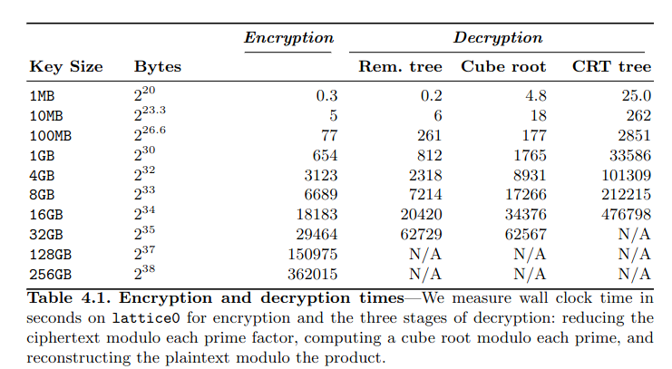

# find-the-paper

- Category: Crypto
- Final Point Value: 130
- Solves: 98
  
## Description

here is a screenshot from a paper 

the flag format is cursed{last name 1, last name 2, ..., last name n}

## Solve

Finding this flag was fairlhy straight forward. Although it's listed under crypto, this challenge was closer to OSINT to find the flag. 

Starting off, I downloaded the image and ran it though a reverse image search. However, doing this caused many similar looking research papers to show up, making it hard to filter through them and find the actual paper there if it was even there. 

I then proceeded to simply search up the caption of the table, and lo and behold, a pdf document of a research paper labeled [*Post-Quantum RSA*](https://cr.yp.to/papers/pqrsa-20170419.pdf) popped up as the first result. After scrolling through, I found the same table given.

This leaves us with four last names for the flag: Bernstein, Heninger, Lou, and Valenta. Of course, my first insinct was to enter the names in order. However this did not work. I quickly realized that I would likely have to go through all 24 different permutations of the names due to the cursed nature of the competition.

After a bit of brute force, I ended up getting the correct order of last names leaving me with the answer:

`cursed{Lou, Heninger, Bernstein, Valenta}`

Flag found!
