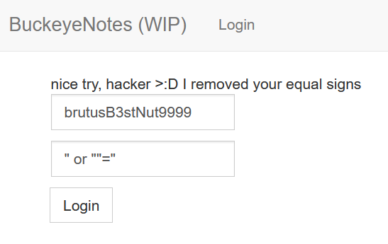
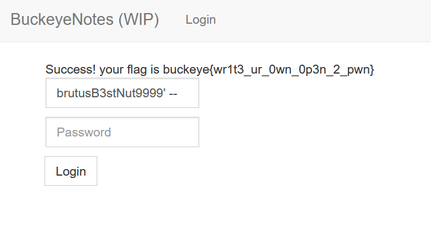

# buckeyenotes

- Category: Web
- Difficulty: Beginner
- Final Point Value: 50
- Solves: 343
  
## Description

Note taking apps are all the rage lately but turns our they're harder to make than I thought :/. Even in development buckeyenotes has gotten some traction, Brutus signed up! I think his user name is brutusB3stNut9999. I wonder what kind of notes he writes 🤔 but I don't have his login....

[https://buckeyenotes.chall.pwnoh.io](https://buckeyenotes.chall.pwnoh.io)

## Solve

Clicking on the link allows us to access a site with a username and password input box. This immedatiely tipped me off that SQL injection will likely be involved in finding the flag.

First, I began entering in the username provided in the description, *brutusB3stNut9999*, and a SQL injection where "=" is true into the password box (" or ""="). However, it seems that the developer knew about this injection and prevented the use of "=" in the password box.

After this first attempt, I used a injection where everything after the username evaulation is commented out with the use of **--**. By entering in *brutusB3stNut9999' --* in the username box, we were able to find the flag!

`buckeye{wr1t3_ur_0wn_0p3n_2_pwn}`

Flag found!
