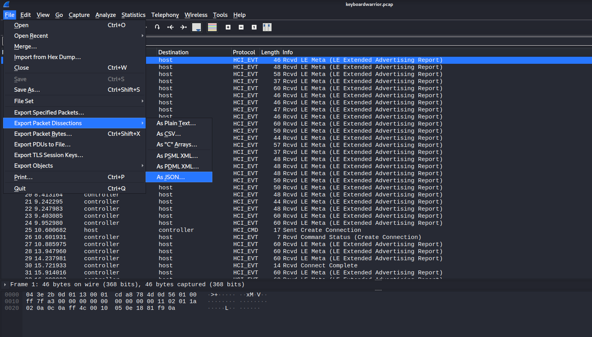
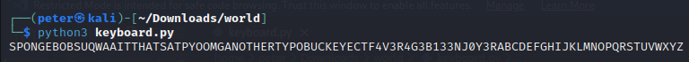

# keyboardwarrior

- Category: Misc
- Difficulty: Medium
- Final Point Value: 176
- Solves: 82
  
## Description

I found a PCAP of some Bluetooth packets being sent on this guy's computer. He's sending some pretty weird stuff, you should take a look.

Flag format: buckeyectf{}

[keyboardwarrior.pcap](keyboardwarrior.pcap)

## Solve

Starting from the name of the challenge and the description given, it was clear that the pcap file contains keystroke data from a bluetooth keyboard.

First, I ran the pcap file through wireshark to find any abnormalities or points of interest to start digging for the flag. However, since I was not very well versed with wireshark, I was unable to find anything and ended up searching around the internet on how to decode the file.

I ended up stumbling across a CTF writeup for a challenge called **[Magic in the Air](https://github.com/spitfirerxf/rgbCTF2020/tree/master/PI1)** for rgbCTF 2020 that gave me the information to decode the pcap file.

First, the python script used to decode the file, required the file be in **JSON** to interpret the keystoke packets. To do this, I exported the file using wireshark as a JSON file shown below.



With the pcap exported as JSON, I then modified the python script from **[Magic in the Air](https://github.com/spitfirerxf/rgbCTF2020/tree/master/PI1)** to produce cleaner results.

```python
import json

j = ""

with open("keyboard.json", "r") as f:
    j = f.read()

loaded = json.loads(j)

allhex = []

for i in loaded:
    try:
        if i["_source"]["layers"]["btatt"]["btatt.value"][:2] == "00":
            allhex.append(i["_source"]["layers"]["btatt"]["btatt.value"])
    except:
        pass

    keycodeDict = {"MOD_LCTRL": "0x01"," MOD_LSHIFT": "0x02"," MOD_LALT": "0x04"," MOD_LMETA": "0x08"," MOD_RCTRL": "0x10"," MOD_RSHIFT": "0x20"," MOD_RALT": "0x40"," MOD_RMETA": "0x80"," ERR_OVF": "0x01","A": "0x04","B": "0x05","C": "0x06","D": "0x07","E": "0x08","F": "0x09","G": "0x0a","H": "0x0b","I": "0x0c","J": "0x0d","K": "0x0e","L": "0x0f","M": "0x10","N": "0x11","O": "0x12","P": "0x13","Q": "0x14","R": "0x15","S": "0x16","T": "0x17","U": "0x18","V": "0x19","W": "0x1a","X": "0x1b","Y": "0x1c","Z": "0x1d","1": "0x1e","2": "0x1f","3": "0x20","4": "0x21","5": "0x22","6": "0x23","7": "0x24","8": "0x25","9": "0x26","0": "0x27","ENTER": "0x28","ESC": "0x29","BACKSPACE": "0x2a","TAB": "0x2b","SPACE": "0x2c","MINUS": "0x2d","EQUAL": "0x2e","LEFTBRACE": "0x2f","RIGHTBRACE": "0x30","BACKSLASH": "0x31","HASHTILDE": "0x32","SEMICOLON": "0x33","APOSTROPHE": "0x34","GRAVE": "0x35","COMMA": "0x36","DOT": "0x37","SLASH": "0x38","CAPSLOCK": "0x39","F1": "0x3a","F2": "0x3b","F3": "0x3c","F4": "0x3d","F5": "0x3e","F6": "0x3f","F7": "0x40","F8": "0x41","F9": "0x42","F10": "0x43","F11": "0x44","F12": "0x45","SYSRQ": "0x46","SCROLLLOCK": "0x47","PAUSE": "0x48","INSERT": "0x49","HOME": "0x4a","PAGEUP": "0x4b","DELETE": "0x4c","END": "0x4d","PAGEDOWN": "0x4e","RIGHT": "0x4f","LEFT": "0x50","DOWN": "0x51","UP": "0x52","NUMLOCK": "0x53","KPSLASH": "0x54","KPASTERISK": "0x55","KPMINUS": "0x56","KPPLUS": "0x57","KPENTER": "0x58","KP1": "0x59","KP2": "0x5a","KP3": "0x5b","KP4": "0x5c","KP5": "0x5d","KP6": "0x5e","KP7": "0x5f","KP8": "0x60","KP9": "0x61","KP0": "0x62","KPDOT": "0x63","102ND": "0x64","COMPOSE": "0x65","POWER": "0x66","KPEQUAL": "0x67","F13": "0x68","F14": "0x69","F15": "0x6a","F16": "0x6b","F17": "0x6c","F18": "0x6d","F19": "0x6e","F20": "0x6f","F21": "0x70","F22": "0x71","F23": "0x72","F24": "0x73","OPEN": "0x74","HELP": "0x75","PROPS": "0x76","FRONT": "0x77","STOP": "0x78","AGAIN": "0x79","UNDO": "0x7a","CUT": "0x7b","COPY": "0x7c","PASTE": "0x7d","FIND": "0x7e","MUTE": "0x7f","VOLUMEUP": "0x80","VOLUMEDOWN": "0x81","KPCOMMA": "0x85","RO": "0x87","KATAKANAHIRAGANA": "0x88","YEN": "0x89","HENKAN": "0x8a","MUHENKAN": "0x8b","KPJPCOMMA": "0x8c","HANGEUL": "0x90","HANJA": "0x91","KATAKANA": "0x92","HIRAGANA": "0x93","ZENKAKUHANKAKU": "0x94","KPLEFTPAREN": "0xb6","KPRIGHTPAREN": "0xb7","LEFTCTRL": "0xe0","LEFTSHIFT": "0xe1","LEFTALT": "0xe2","LEFTWINDOWS": "0xe3","RIGHTCTRL": "0xe4","RIGHTSHIFT": "0xe5","RIGHTALT": "0xe6","RIGHTMETA": "0xe7","MEDIA_PLAYPAUSE": "0xe8","MEDIA_STOPCD": "0xe9","MEDIA_PREVIOUSSONG": "0xea","MEDIA_NEXTSONG": "0xeb","MEDIA_EJECTCD": "0xec","MEDIA_VOLUMEUP": "0xed","MEDIA_VOLUMEDOWN": "0xee","MEDIA_MUTE": "0xef","MEDIA_WWW": "0xf0","MEDIA_BACK": "0xf1","MEDIA_FORWARD": "0xf2","MEDIA_STOP": "0xf3","MEDIA_FIND": "0xf4","MEDIA_SCROLLUP": "0xf5","MEDIA_SCROLLDOWN": "0xf6","MEDIA_EDIT": "0xf7","MEDIA_SLEEP": "0xf8","MEDIA_COFFEE": "0xf9","MEDIA_REFRESH": "0xfa","MEDIA_CALC": "0xfb"}
inv_map = {v: k for k, v in keycodeDict.items()}
for i in allhex:
    h = "0x" + i[6:8]
    try:
            print(inv_map[h], end = '')
    except:
        pass
```

Running the python script allowed us to find the flag! Although the script does not recognize curly braces and underscores, we were able to find the signature *"buckeyectf"* and guess where the flag & phrases ended.



`buckeyectf{4v3r4g3_b13_3nj0y3r}`

Flag found!
