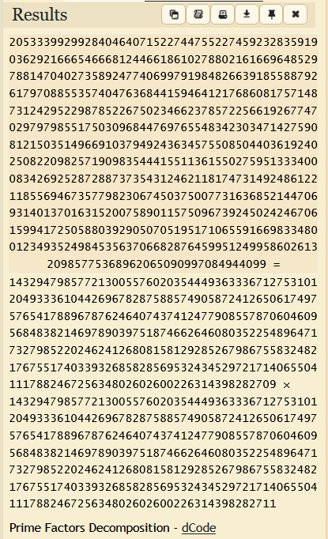
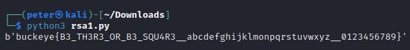

# Twin prime RSA

- Category: Crypto
- Difficulty: Easy
- Final Point Value: 100
- Solves: 167
  
## Description

Real winners use twin primes

[chall.py](chall.py)

## Solve

Given the title of the challenge, it is obvious that we will be decrypting an RSA problem. Since I am unfamiliar with RSA, I primarily followed the wikipedia steps that highlight how to decrypt [RSA](https://en.wikipedia.org/wiki/RSA_(cryptosystem)#Decryption)s.

Reading through the python script provided, we are provided with the public key (n, e) and the ciphertext value (c). We also know that the value of n = pq. These two variables (p & q) are vital for finding the private key (n, d). Although it is possible to solve for p and q through factorization, it is much easier to put them through an [online decoder](https://www.dcode.fr/prime-factors-decomposition).



With the values of p & q found, decoding the ciphertext is fairly straightforward. The private exponent d can be calculated by finding the [Euler totient function](https://en.wikipedia.org/wiki/Euler%27s_totient_function) (phi = (p - 1) \* (q - 1)) and using it in the function d*e = 1 mod phi. With this, we can find the original message through the equation c^d mod n and change the value back to bytes.

```python
import math
import Crypto.Util.number as cun

n = 20533399299284046407152274475522745923283591903629216665466681244661861027880216166964852978814704027358924774069979198482663918558879261797088553574047636844159464121768608175714873124295229878522675023466237857225661926774702979798551750309684476976554834230347142759081215035149669103794924363457550850440361924025082209825719098354441551136155027595133340008342692528728873735431246211817473149248612211855694673577982306745037500773163685214470693140137016315200758901157509673924502424670615994172505880392905070519517106559166983348001234935249845356370668287645995124995860261320985775368962065090997084944099
c = 786123694350217613420313407294137121273953981175658824882888687283151735932871244753555819887540529041840742886520261787648142436608167319514110333719357956484673762064620994173170215240263058130922197851796707601800496856305685009993213962693756446220993902080712028435244942470308340720456376316275003977039668016451819131782632341820581015325003092492069871323355309000284063294110529153447327709512977864276348652515295180247259350909773087471373364843420431252702944732151752621175150127680750965262717903714333291284769504539327086686569274889570781333862369765692348049615663405291481875379224057249719713021

p = 143294798577213005576020354449363336712753101204933361044269678287588574905872412650617497576541788967876246407437412477908557870604609568483821469789039751874662646080352254896471732798522024624126808158129285267986755832482176755174033932685828569532434529721714065504111788246725634802602600226314398282709
q = 143294798577213005576020354449363336712753101204933361044269678287588574905872412650617497576541788967876246407437412477908557870604609568483821469789039751874662646080352254896471732798522024624126808158129285267986755832482176755174033932685828569532434529721714065504111788246725634802602600226314398282711

e = 0x10001

phi = (p - 1) * (q - 1)
#print(phi)
d = pow(e, -1, phi)
#print(d)

m = pow(c, d, n)
#print(m)
flag = cun.long_to_bytes(m)
print(flag)
```



`buckeye{B3_TH3R3_OR_B3_SQU4R3__abcdefghijklmonpqrstuvwxyz__0123456789}`

Flag found!
