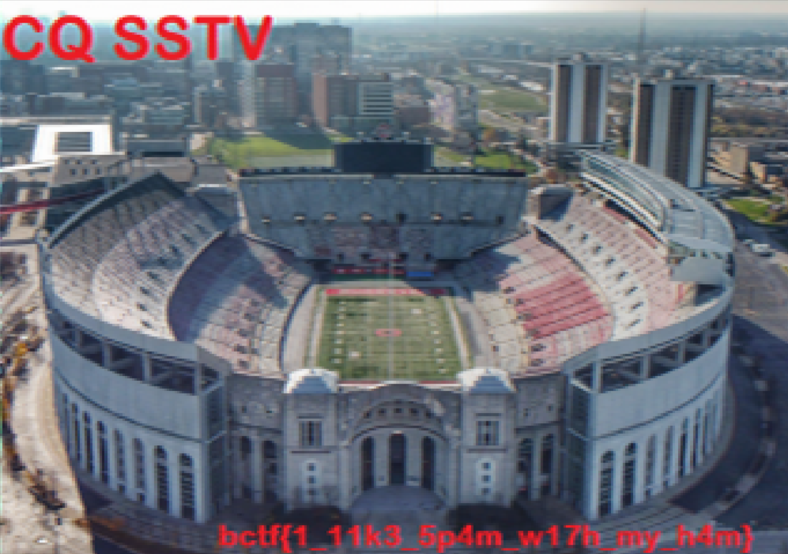

# Couch Potato

- Category: Forensics
- Points: 497
- Solves: 93

## Description
I am a real american, down to my favorite pastime!

[dump.wav](dump.wav)

## Solve
This challege was definetly one of my favorites for this year's CTF. Typically, when given a .wav, you would expect it to be some sort of audio stenography or perhaps display text through a spectograph. This challenge was different, after spending an hour or two with no progress, I began searching for different ways to hide information.

After going back and listening to the audio, the first thing that came to my mind was dial-up tones, so I began searching around for a way to somehow convert dial up to text. Coincidently, I came across [reddit post](https://www.reddit.com/r/Steganography/comments/15uniha/is_there_a_tool_for_converting_audio_that_sounds/) with the exact solution I needed.

In this post, a user suggested the use of SSTV radio transmission was a method of encoding an image to wav paired with an audio sample with was extremily similar to the one provided with this challenge. 

To decrypt the .wav file, I first began by downloading a tool called [MMSSTV](https://hamsoft.ca/pages/mmsstv.php). After that I downloaded a [virtual audio cable](https://vb-audio.com/Cable/), allowing me to connect the output sound from the wav and redirect it into MMSSTV.

Doing this generated the image below.

`bctf{1_11k3_5p4m_w17h_my_h4m}`

Flag found!