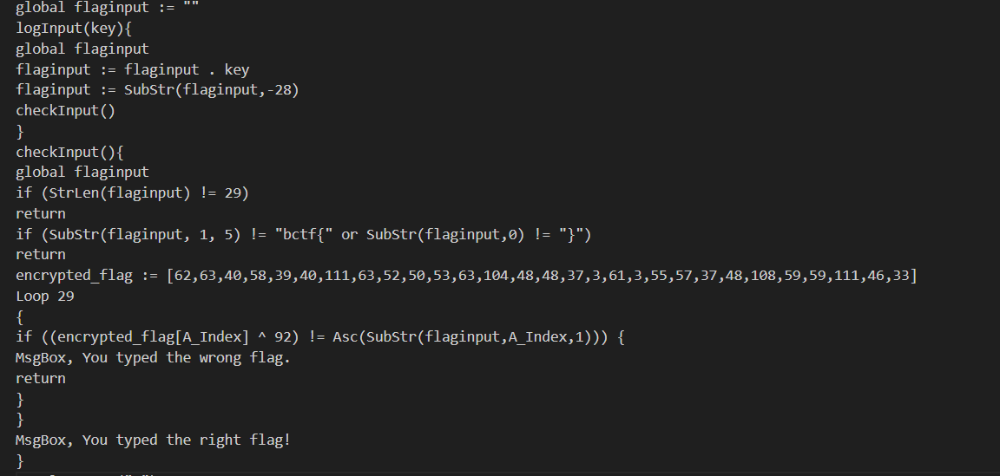

# Flagwatch

- Category: Rev
- Points: 477
- Solves: 180

## Description
Did you know that you can [compile](https://github.com/AutoHotkey/Ahk2Exe) AutoHotKey scripts?

[flagwatch.exe](flagwatch.exe)

## Solve
This challenge was actually really straight forward. Starting off, running the executable was not doing anything in particular. However, when viewing the exe in a text editor, I was able to find portions of code at the very bottom.



Analyzing this code, it appears that the executable was running XOR encryption for the flag and we even get the encrypted flag in this snippet! After find out about this, I quickly made a script to decrypt the flag.

```python
# The encrypted flag as provided in the script
encrypted_flag = [62, 63, 40, 58, 39, 40, 111, 63, 52, 50, 53, 63, 104, 48, 48, 37, 3, 61, 3, 55, 57, 37, 48, 108, 59, 59, 111, 46, 33]

# The key used for XOR operation
xor_key = 92

# Decrypting the flag
decrypted_flag = ''.join(chr(value ^ xor_key) for value in encrypted_flag)

# Adding the required prefix and suffix
final_flag = decrypted_flag

print(final_flag)
```
Running the script gives
`bctf{t3chnic4lly_a_keyl0gg3r}`

Flag found!