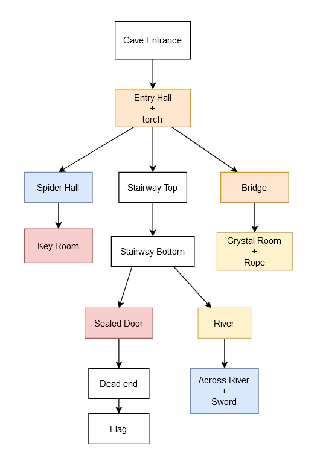

# Text Adventure

- Category: Rev
- Points: 50
- Solves: 212

## Description
I just wrote a text adventure game after learning Java, but maybe I should've added some instructions....

`nc challs.pwnoh.io 13376`

[text-adventure.zip](text-adventure.zip)

## Solve
This challenge involve decompiling a provided jar file. I simply ran the file through an [online java decompiler](http://www.javadecompilers.com/), allowing me to see the contents and specific prompts to move around. After this I connected to `nc challs.pwnoh.io 13376` through the terminal and went through the sequence of events specified in the java files to get to the final room. The resulting room structures ended up looking like the diagram below.

`bctf{P33r_1nT0_tH3_j4r_2_f1nd_Th3_S3cR3Ts_d1463580a690f294}`

Flag found!