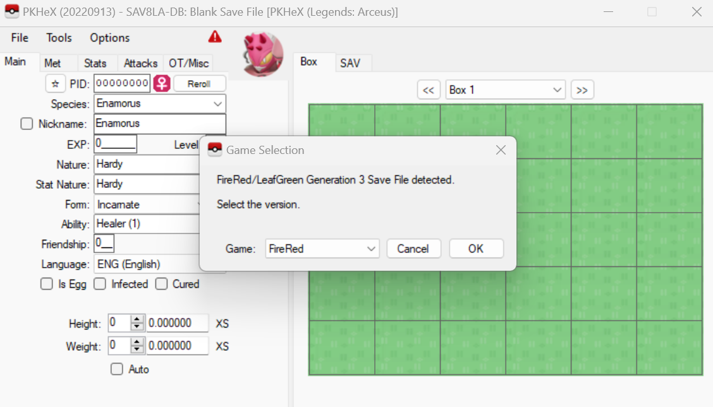
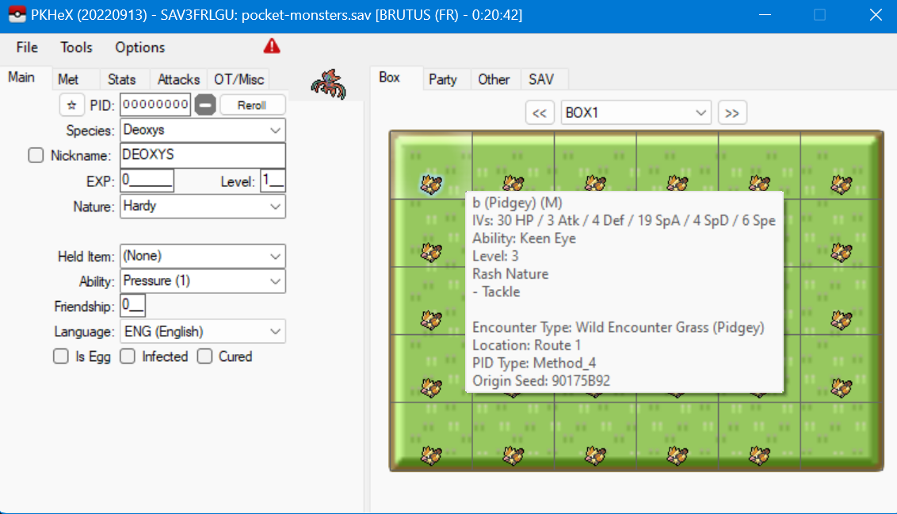

# pocket-monsters

- Category: Misc
- Difficulty: Medium
- Final Point Value: 266
- Solves: 55
  
## Description

Something happened to my save and now my game won't run :sadge: all my precious Pokemon are gone :sob: please help...

Flag format: buckeye(...)

[pocket-monsters.sav](pocket-monsters.sav)

## Solve

The solution I found for this challenge ended up simpler than expected. While we know that the .sav file was corrupted, we also knew that it was a save file for a Pokemon game.

Knowing this, I searched up *"pokemon save file editor"* and found an extremily useful tool for this challenge called **[PKHeX](https://github.com/kwsch/PKHeX)**.

Running PKHex and loading the .sav file indicated that the file was from FireRed/LeafGreen Generation 3 Pokemon game.

PKHeX revealed 29 Pidgeys in the box, each named after a letter contained in the flag.

Putting together the characters revealed the flag:
`buckeye(90774-3mu1473-3m-411)`

Flag found!
