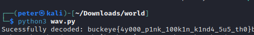

# sus

- Category: Misc
- Difficulty: Easy
- Final Point Value: 288
- Solves: 50
  
## Description

Something about this audio is pretty sus...

Hint: The crackling in the audio should tell you that something's wrong.

[sus.wav](sus.wav)

## Solve

When reading the hint provided in the description and listening to the audio file itself, it should be clear that the the flag would be hidden in the least significant bits (LSB) of each byte in the audio file.

Knowing this, we can determine that **LSB audio stegnography decoding** must be performed on the wav file to extract the flag.

Looking up *"LSB audio steg"* led me to this [site](https://sumit-arora.medium.com/audio-steganography-the-art-of-hiding-secrets-within-earshot-part-2-of-2-c76b1be719b3) where I managed to find a python script that does all the work for me. The adapted code can be referenced below.

```python
# Use wave package (native to Python) for reading the received audio file
import wave
song = wave.open("sus.wav", mode='rb')
# Convert audio to byte array
frame_bytes = bytearray(list(song.readframes(song.getnframes())))

# Extract the LSB of each byte
extracted = [frame_bytes[i] & 1 for i in range(len(frame_bytes))]
# Convert byte array back to string
string = "".join(chr(int("".join(map(str,extracted[i:i+8])),2)) for i in range(0,len(extracted),8))
# Cut off at the filler characters
decoded = string.split("###")[0]

# Print the extracted text
print("Sucessfully decoded: "+decoded)
song.close()
```

Running the python script produced the result below:



`buckeye{4y000_p1nk_100k1n_k1nd4_5u5_th0}`

Flag found!
