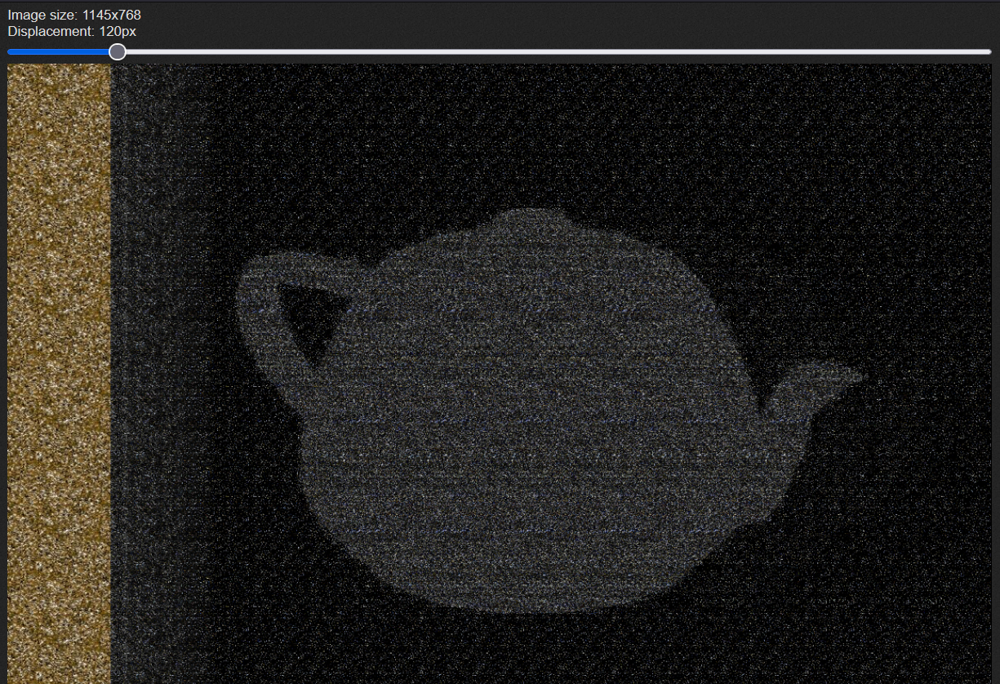

# Abstract Art

- Category: Misc
- Difficulty: Medium
- Final Point Value: 100
- Solves: 137
  
## Description

I saw this new painting in a gallery by famed painter Otto Stairee O'Graham. Everyone raves about how clearly it represents some common motif, but looking at it just makes me go cross-eyed.

flag is: `wctf{name of object in painting}`(hint: it's two syllables)

## Solve

This challenge was very easy. Looking at the provided image it is pretty obvious it is an autostereogram. If you couldn't tell, simply running the image through a reverse image search will show that it is a stereogram.

Knowing that it is a stereogram, the next obvious step is to search for a stereogram decoder. Plugging the image in the [first website](https://piellardj.github.io/stereogram-solver/) that popped up resulted in the following image.

`wctf{teapot}`

Flag found!
